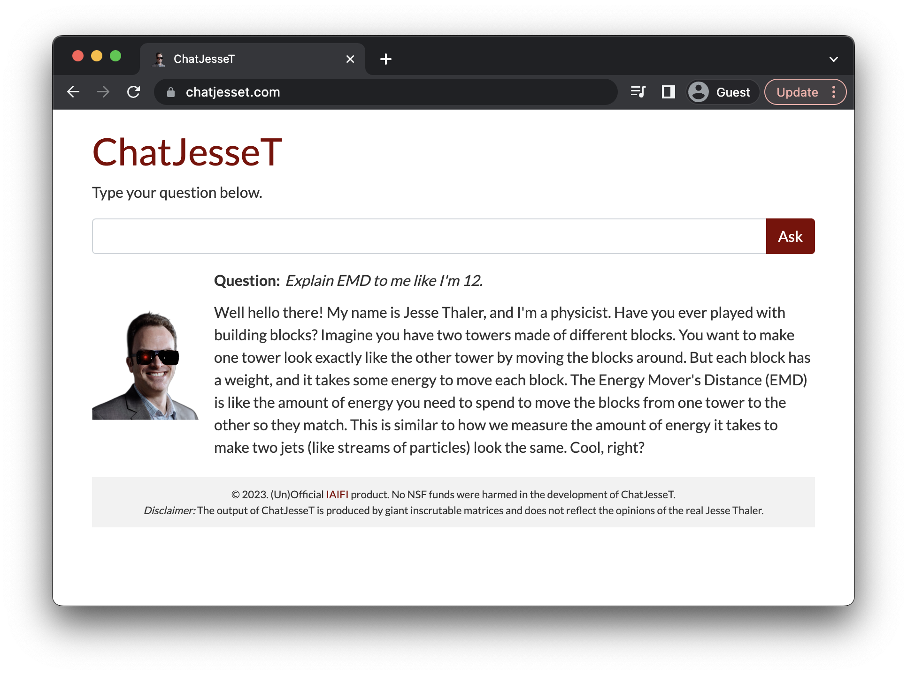

# [ChatJesseT](https://chatjesset.com/)

Created for April Fools' 2023 as a Flask app using OpenAI embeddings and chat completion. Uses the `gpt-3.5-turbo` model by default. With apologies to [Jesse Thaler](https://jthaler.net/).



## Setup

1. `requirements_test.txt` contains the full Python environment used for development and testing. `requirements.txt` contains the more minimal version for deploying the Flask app. Set up an environment accordingly.

2. Set the OpenAI key (for embedding and chat completion calls):
```
export OPENAI_API_KEY="sk-xxx..."
```

3. Set a system prompt at `data/db/system_prompt.txt` and a context 
prompt at `data/db/context_prompt.txt`. The former will guide the general 
characteristics of the chatbot, while the later will give a stronger 
immediate signal. These are hidden from the repo for now for comedic 
purposes.

4. To create text chunks and embeddings, run [`notebooks/01_data_collection.ipynb`](notebooks/01_data_collection.ipynb) and [`notebooks/02_embedding.ipynb`](notebooks/02_embedding.ipynb).

5. For local testing, simply do
```
python main.py
```
and navigate to `http://127.0.0.1:8080/`. If loading text chunks and embeddings locally (rather than from cloud storage), uncomment the relevant lines in the `run()` function in [chatjesset.py](chatjesset.py).

## Deployment 

The site is deployed via Google App Engine (GAE).

1. See [here](https://cloud.google.com/appengine/docs/standard/python3/runtime) and [here](https://cloud.google.com/docs/authentication/provide-credentials-adc#how-to) for preliminary steps necessary for Google Cloud / App Engine deployment. 

2. Upload the text chunks and embeddings to Google Cloud for more efficient data loading; this can be done by manually uploading to the remote bucket specified in the `run()` function in [chatjesset.py](chatjesset.py). If loading text chunks and embeddings locally (rather than from cloud storage), uncomment the relevant lines in the `run()` function in [chatjesset.py](chatjesset.py).

3. Copy `app_deploy.yaml` to `app.yaml` and edit with the OpenAI API Key and other GAE info, like instance types.

4. Deploy website through the Google App Engine with
```
gcloud app deploy
```
and navigate to the remote URL via
```
gcloud app browse
```

## Credit

Rikab Gambhir and Cari Cesarotti for prompt engineering. Loading animation from [EnergyFlow](https://energyflow.network/examples/#animation_examplepy).
